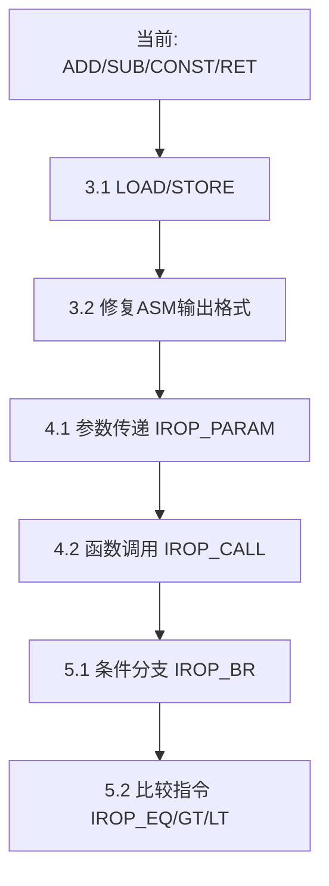

# C51后端下一步工作计划（可测试）

基于 [`c51_implementation_flow.md`](plans/c51_implementation_flow.md:1) 和现有测试文件，整理可测试的阶段性目标。

---

## 当前状态

| 阶段 | 状态 | 说明 |
|------|------|------|
| 第一阶段：基础框架 | ✅ 完成 | 全局变量、函数框架、ASM输出 |
| 第二阶段：指令选择基础 | ✅ 完成 | CONST、ADD、SUB、RET |
| 第三阶段：寄存器分配 | ⏳ 待开始 | 仅硬编码R4-R7，需实现真实分配 |
| 第四阶段：函数支持 | ⏳ 待开始 | 参数传递、返回值、函数调用 |
| 第五阶段：内存访问 | ⏳ 待开始 | LOAD/STORE指令 |
| 第六阶段：控制流 | ⏳ 待开始 | 分支跳转 |

---

## 阶段三：内存访问指令（优先，因为test_isel_mem.c需要）

### 3.1 实现 IROP_LOAD / IROP_STORE

**目标**: 让 [`test/test_isel_mem.c:41`](test/test_isel_mem.c:41) 的 `test_data_rw` 函数能正确生成汇编

**测试代码**:
```c
int test_data_rw(int v) {
    unsigned char data local;
    g_data = (unsigned char)v;  // STORE
    local = g_data;             // LOAD
    g_data = local + 1;         // STORE
    return g_data;              // LOAD
}
```

**期望输出**:
```asm
_test_data_rw:
        ; 参数v在R6:R7
        MOV     A, R7
        MOV     _g_data, A      ; STORE g_data, v
        
        MOV     A, _g_data      ; LOAD local, g_data
        MOV     R0, A           ; local用R0暂存
        
        INC     A               ; local + 1
        MOV     _g_data, A      ; STORE g_data, local+1
        
        MOV     R7, A           ; 返回值
        MOV     R6, #0
        RET
```

**实现文件**: [`c51_instr.c`](src/core/c51/c51_instr.c:1)
- 添加 `case IROP_LOAD:` 处理
- 添加 `case IROP_STORE:` 处理

**验证方式**:
```bash
printf '6\ntest/test_isel_mem.c\n' | ./build.sh
```

---

## 阶段四：函数参数与返回值

### 4.1 实现参数传递约定

**目标**: 让 [`test/test_call.c:1`](test/test_call.c:1) 的 `add3` 函数能接收参数

**测试代码**:
```c
int add3(int a, int b, int c) {
    return a + b + c;
}
```

**Keil C51约定**:
| 参数 | 位置 |
|------|------|
| char a | R7 |
| char b | R5 |
| char c | R3 |
| int a | R6:R7 |
| int b | R4:R5 |

**期望输出**:
```asm
_add3:
        ; a在R6:R7, b在R4:R5, c在R2:R3
        MOV     A, R7
        ADD     A, R5
        ADD     A, R3
        MOV     R7, A           ; 低字节和
        
        MOV     A, R6
        ADDC    A, R4
        ADDC    A, R2
        MOV     R6, A           ; 高字节和
        RET
```

**实现要点**:
1. [`c51_gen_function.h`](src/core/c51/c51_gen_function.h:1) 中 `handle_function_init` 根据参数列表分配寄存器
2. [`c51_instr.c`](src/core/c51/c51_instr.c:1) 中处理 `IROP_PARAM`

**验证方式**:
```bash
printf '6\ntest/test_call.c\n' | ./build.sh
```

---

## 阶段五：函数调用

### 5.1 实现 IROP_CALL

**目标**: 让 [`test/test_call.c:12`](test/test_call.c:12) 的 `caller` 函数能调用 `add3`

**测试代码**:
```c
int caller(int x) {
    return add3(x, 1, 2);
}
```

**期望输出**:
```asm
_caller:
        ; x在R6:R7
        MOV     R4, #0          ; b高字节
        MOV     R5, #1          ; b低字节
        MOV     R2, #0          ; c高字节
        MOV     R3, #2          ; c低字节
        ; a已经在R6:R7
        LCALL   _add3
        ; 返回值在R6:R7
        RET
```

**实现文件**: [`c51_instr.c`](src/core/c51/c51_instr.c:1)
- 添加 `case IROP_CALL:` 处理
- 需要解析参数并设置到约定寄存器

**验证方式**:
```bash
printf '6\ntest/test_call.c\n' | ./build.sh
```

---

## 阶段六：控制流（分支跳转）

### 6.1 实现 IROP_BR 条件分支

**目标**: 让 [`test/test_c51.c:19`](test/test_c51.c:19) 的 `cmp_ops` 函数能生成比较和跳转

**测试代码**:
```c
int cmp_ops(int a, int b) {
    int r = 0;
    if (!(a - b)) r = r + 1;   // a == b
    if (a > b)  r = r + 16;    // a > b
    return r;
}
```

**期望输出**:
```asm
_cmp_ops:
        ; a在R6:R7, b在R4:R5
        CLR     C
        MOV     A, R7
        SUBB    A, R5           ; a - b
        JNZ     L_not_equal
        ; 等于分支
        INC     R3              ; r++
L_not_equal:
        ; 比较 a > b
        CLR     C
        MOV     A, R7
        SUBB    A, R5
        MOV     A, R6
        SUBB    A, R4           ; 借位判断
        JC      L_not_greater
        ; 大于分支
        ADD     R3, #16
L_not_greater:
        MOV     R7, R3          ; 返回r
        MOV     R6, #0
        RET
```

**实现文件**: [`c51_instr.c`](src/core/c51/c51_instr.c:1)
- 添加 `case IROP_BR:` 处理
- 添加 `case IROP_JMP:` 处理
- 添加 `case IROP_EQ/GT/LT/...:` 处理（生成状态位）

**验证方式**:
```bash
printf '6\ntest/test_c51.c\n' | ./build.sh
```

---

## 阶段七：优化ASM输出格式

### 7.1 修复输出格式

**当前问题**:
```asm
MOV     R6, #0        MOV R6, #0 ; %7 = const
```

**期望格式**:
```asm
        MOV     R6, #0          ; %7 = const
```

**修改文件**: [`c51_output.c:print_asminstr`](src/core/c51/c51_output.c:31)

---

## 执行顺序建议



**推荐下一步**: **3.1 实现LOAD/STORE**，因为这是最基础且test_isel_mem.c需要的功能。

---

## 快速验证命令

```bash
# 测试内存访问
printf '6\ntest/test_isel_mem.c\n' | ./build.sh 2>&1 | grep -A20 "_test_data_rw"

# 测试函数调用
printf '6\ntest/test_call.c\n' | ./build.sh 2>&1 | grep -A20 "_add3"

# 测试完整C51
printf '6\ntest/test_c51.c\n' | ./build.sh 2>&1 | grep -A30 "_cmp_ops"
```

@test_data_rw(v: int): int {
    v1: int = param v
    v2: ptr = addr @g_data @data
    v3: char = trunc v1
    store v2, v3 @data
    v8: char = add v3, const 1
    store v2, v8 @data
    ret v8
}